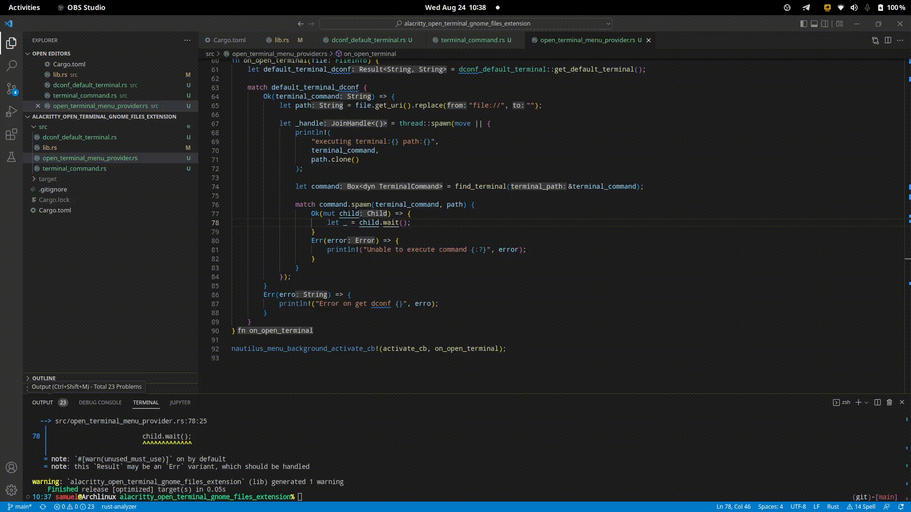

# Alacritty Open Terminal Extension

Extensão para o nautilus para abrir Alacritty

## Limitações

Como utilizo a label "Open in Terminal", removi o pacote **gnome-terminal** do arch linux para evitar conflitos.

```shell
sudo pacman -R gnome-terminal
```

Não há suporte a diferentes idiomas, uma vez que "Open in Terminal" é hardcoded.

Necessidade de alterar o script **/usr/bin/alacritty_wayland**:

```shell
#/usr/bin/alacritty_wayland, 
env WAYLAND_DISPLAY= alacritty "$@"
# "$@" permite que passe todos argumentos do shell para o alacritty
```

Utilização do path dconf **/org/gnome/desktop/applications/terminal/exec**,
dessa forma para utilizado o alacritty no gnome com wayland devesse atualizar
o caminho:

```bash
gsettings set org.gnome.desktop.default-applications.terminal exec "/usr/bin/alacritty_wayland"
```

## instalação

A aplicação é uma biblioteca que é carregada dinamicamente pelo Gnome files
também conhecido como nautilus. O nautilus carrega todas as dynamic libraries
presentes na sua pasta de configuração **nautilus/extensions-3.0/**.
Então para instalar a aplicação siga os passos:

- clone o repositório
- compile a aplicação rust com cargo
- mova o binário para a pasta **nautilus/extensions-3.0/**
  
```bash
git clone https://github.com/samuel-cavalcanti/alacritty_open_terminal_extension

cd  alacritty_open_terminal_extension

cargo build --release

# no archlinux as libs do nautilus ficam no usr/lib/nautilus
sudo cp target/release/libopen_in_termial.so /usr/lib/nautilus/extensions-3.0/  
```

## Demostração



link para o vídeo: [Open in Terminal Gnome Files Rust extension (prototype)](https://youtu.be/AmCSgCvZnP0)
